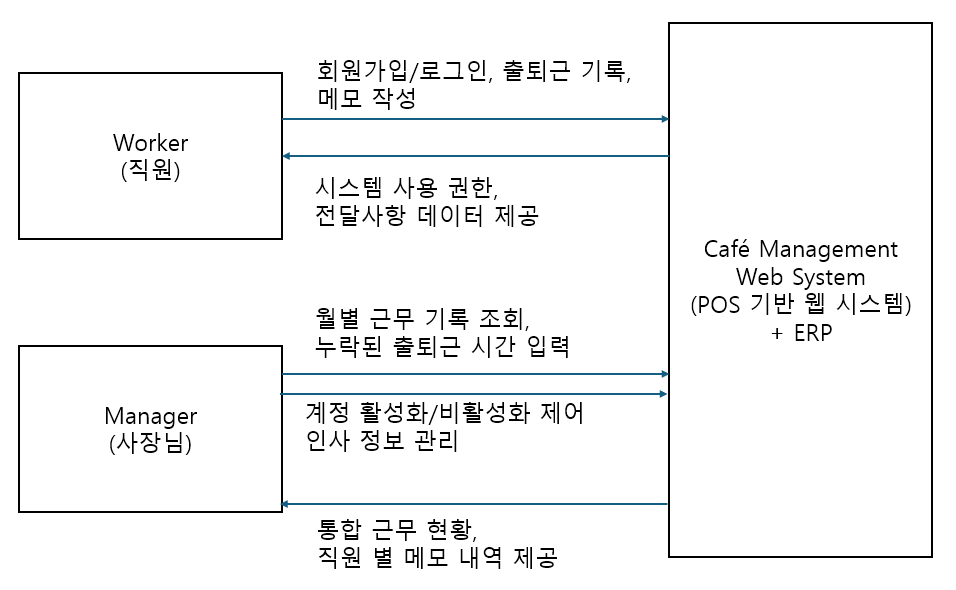

# 1. Conceptualization
Project Title - cafe management
Student No - 22212051
Name - 김지은
E-mail - jieunkim1117@gmail.com

#### [Revision History]
|Revision date|Version #|Description|Author|
|-------------|---------|-----------|------|
|03/17/2026|1.00|First|김지은|

### 1. Business purpose
Project background & Motivation
- 소통 채널의 파편화
현재 많은 카페에서 교대 근무자 간의 전달사항(재고 부족, 컴플레인, 예약 등)이 카카오톡 등 개인 메신저를 통해 이루어지고 있다.
현재 일하고 있는 카페 역시 카카오톡을 통해 정보를 전달하기도 하지만 교대자는 교대 직전 정보를 전달받기도 한다. 이런 경우 교대 시간에 손님이 몰려 전달사항을 누락하거나, 급한일을 먼저 처리하다 전달사항을 잊고 퇴근을 해버리는 경우도 가끔 있다.
- 근무 시간 기록의 부정확성
지각, 조기 퇴근 등 변동된 근무 시간을 관리자가 매번 수동으로 확인하고 기록한다. 만약 사장님이 근무하지 않는 날인 경우 cctv를 확인해야 하거나, 퇴근 시간을 알바생의 양심에 맡기는 경우가 많다.

Goal
- 별도의 앱 설치 없이 카페 매장 내 포스기(POS)의 웹 브라우저를 통해 모든 근무자가 공통으로 접근할 수 있는 통합 관리 시스템을 구축한다.
- 알바생과 사장님의 계정 권한을 분리하여, 사장님 전용 ERP(인사/급여 관리)대시보드를 제공함으로써 매장 운영의 효울성을 향상시킨다.

Target market
- 교대 근무가 잦고 체계적인 알바생 관리가 필요한 소규모 및 중소형 프랜차이즈 카페 사장
- 인사 관리(시급, 직급, 근무시간)와 매장 소통을 하나의 웹 서비스로 통합하고자 하는 카페 사장님

### 2. System context diagram

- Worker (알바생)
매장에서 교대로 근무하며 시스템에 출퇴근을 기록하고 다음 근무자에게 전달사항을 남기는 일반 권한 사용자이다.
- Manager (사장님)
매장의 전체적인 운영을 총괄하는 최고 권한 사용자이다. 알바생이 사용하는 기본 기능 외에, 사장님 전용 대시보드를 통해 월별 근무 기록 통합 조회, 알바생의 누락된 출퇴근 시간 보완(입력만 가능, 수정 불가), 직원 계정 상태(활성화/비활성화) 및 인사 정보(시급, 직급 등) 관리를 수행한다.
- Cafe Management Web System (카페 관리 웹 시스템)
별도의 앱 설치 없이 포스기 브라우저를 통해 제공되는 본 프로젝트의 핵심 시스템이다.
- ERP Dashboard (사장님 전용 인사 관리 대시보드)
웹 시스템 내에 포함된 관리자 전용 공간으로, 알바생의 가입/퇴사 통제부터 월별 급여 정산을 위한 출퇴근 통계, 직원별 메모 내역 확인 등 매장 인력 관리에 필요한 통합 데이터를 처리하고 제공한다.

### 3. Use case list
|Use Case|Actor|Desciption|
|--------|--------------|--------------------|
|Sign Up|Worker, Manager|시스템을 사용하기 위해 이름, 아이디, 비밀번호를 입력하여 계정을 생성한다. 가입 즉시 활성화되어 바로 시스템을 사용할 수 있다.|
|Login|Worker, Manager|생성된 아이디와 비밀번호를 입력하여 시스템에 접속하고, 권한(일반/관리자)에 따른 세션을 부여받는다. 퇴사 처리되어 비활성화된 계정은 로그인 불가능하다.|
|Logout|Worker, Manager|시스템 사용을 완료한 후, 현재 연결된 보안 세션을 안전하게 종료하고 초기 화면으로 돌아간다.|
|Clock-in|Worker, Manager|근무 시작 시 출근 버튼을 눌러 서버 시간을 기준으로 정확한 출근 시간을 DB에 기록한다.|
|Clock-out|Worker, Manager|근무 종료 시 퇴근 버튼을 눌러 서버 시간을 기준으로 정확한 퇴근 시간을 DB에 기록한다.|
|Write & Manage Memo|Worker, Manager|특이사항, 재고 상태 등을 텍스트로 작성하며, 본인이 작성한 메모에 한하여 수정/삭제 가능하다.|
|Manage Worker Info(ERP)|Manager|사장님이 알바생의 계정 상태(퇴사 시 비활성화, 재입사 시 활성화)를 제어하고, 개별 정규 시간대, 직급, 시급 등 인사 정보를 통합하여 관리 및 수정한다.|
|View Worker Memos|Manager|사장님이 특정 알바생이 작성한 특이사항 메모 내역을 모아보고 관리한다.|
|View Monthly Work Logs|Manager|사장님이 이번 달 매장의 전체 알바생 출퇴근 기록을 한 번에 모아보고 근무 현황을 파악한다.|
|Insert Missed Time Records|Manager|알바생이 출근 또는 퇴근 버튼을 누르지 못한 경우, 사장님이 누락된 시간을 직접 입력하여 기록을 보완한다. 단, 이미 기록된 시간은 수정 불가함.|

### 4.Concept of operation
1)Sign Up
|구분|내용|
|:---|:---|
|Purpose|신규 근무자의 시스템 접근 계정 생성|
|Approach|이름, ID, PW를 입력하여 가입을 요청한다. 가입 즉시 '활성화(Active)' 상태로 DB에 저장되어 관리자의 별도 승인 없이 바로 시스템을 사용할 수 있다.|
|Dynamics|신규 알바생이 입사하여 최초로 업무에 투입될 때|
|Goals|알바생이 스스로 빠르게 계정을 생성하여 지체 없이 매장 업무와 출퇴근 기록을 시작할 수 있도록 한다.|

2)Login
|구분|내용|
|:---|:---|
|Purpose|사용자 식별 미 접근 권한(Session) 부여|
|Approach|사용자가 ID/PW를 입력하면 서버에서 회원 정보를 대조한다. 정보가 일치하더라도 사장님(Manager)에 의해 비활성화된 계정은 로그인을 차단하고, 활성화된 계정에만 세션을 부여한다.|
|Dynamics|활성화 상태인 근무자가 매장에 출근하여 시스템을 켤 때|
|Goals|권한이 유효한 사용자만 시스템에 접근하도록 안전하게 통제한다.|

3)Logout
|구분|내용|
|:---|:---|
|Purpose|사용자 정보 보호 및 보안 세션 종료|
|Approach|사용자가 로그아웃 버튼을 클릭하면, 서버 측에 저장된 해당 사용자의 세션 정보를 즉시 만료시키고 로그인 화면으로 리다이렉트한다.|
|Dynamics|근무 종료 후 매장 포스기에서 자리를 비울 때|
|Goals|공용 기기(포스기) 사용 시 발생할 수 있는 타인의 계정 도용 및 정보 유출을 방지한다.|

4)Clock-in
|구분|내용|
|:---|:---|
|Purpose|정확한 출근 시간 데이터 수집|
|Approach|출근 버튼 클릭 시 ,클라이언트(브라우저) 조작을 방지하기 위해 백엔드 서버의 현재 시간을 기준으로 DB에 출근 기록을 생성한다. 이미 출근 상태일 경우 중복 요청을 방어한다.|
|Dynamics|근무자가 매장에 도착하여 교대 및 근무를 시작할 때|
|Goals|급여 정산의 기준이 되는 출근 시간 데이터를 확보한다.|

5)Clock-out
|구분|내용|
|:---|:---|
|Purpose|정확한 퇴근 시간 데이터 수집|
|Approach|퇴근 버튼 클릭 시, 가장 최근에 생성된 해당 사용자의 출근 기록을 찾아 서버 시간을 기준으로 퇴근 시간을 업데이트한다.|
|Dynamics|근무자가 본인의 근무 시간을 마치고 퇴근할 때|
|Goals|정확한 근무 종료 시간을 기록하여 알바생 간 교대 시간을 명확히 하고 급여 정산의 혼선을 방지한다|

6)Write & Manage Memo
|구분|내용|
|:---|:---|
|Purpose|매장 내 주요 정보(재고, 특이사항, 예약 등)의 정확한 인수인계|
|Approach|텍스트 형태로 전달사항을 저장하며, 현재 로그인한 세션을 사용자 ID와 메모 작성자의 ID가 일치할 때만 수정 및 삭제 기능을 활성화한다.|
|Dynamics|근무 중 특이사항이 발생하거나 다음 근무자에게 남길 말이 있을 때|
|Goals|개인 메신저의 의존도를 낮추고 누락 없는 정보 공유 환경을 만든다.|

7)Manage Worker Info(ERP)
|구분|내용|
|:---|:---|
|Purpose|사장님의 효율적인 매장 인력 관리 및 급여/인사 정보 전산화|
|Approach|Manager 권한을 가진 계정만 접근할 수 있는 대시보드를 제공한다.퇴사자의 계정을 비활성화하여 로그인을 차단하거나 재입사 시 활성화할 수 있으며, 개별 알바생의 정규 시간대, 직급, 시급 정보를 메모하고 수정한다.|
|Dynamics|사장님이 직원 퇴사/재입사 처리 및 시급 변경 적용을 위해 시스템에 접속할 때|
|Goals|직원 인사 정보를 통합하고, 직원의 상태 변화에 즉각적으로 대응할 수 있는 관리 환경을 제공한다.|

8)View Worker Memos
|구분|내용|
|:---|:---|
|Purpose|매장 내 특이사항 파악|
|Approach|사장님의 관리자 페이지(ERP)내에서 특정 알바생을 선택하면, 해당 알바생이 과거에 작성한 모든 전달사항과 특이사항 메모 내역을 모아서 필터링 조회할 수 있다.|
|Dynamics|사장님이 특정 알바생의 근무 히스토리나 매장 내 이슈를 종합적으로 파악하고자 할 때|
|Goals|알바생 별 업무 수행 기록을 쉽게 확인하여 인사 관리 및 매장 운영의 지표로 활용한다.|

9)View Monthly Work Logs(월별 근무 기록 조회)
|구분|내용|
|:---|:---|
|Purpose|이번 달 전체 근무 기록 파악 및 급여 정산 기초 자료 확보|
|Approach|관리자 페이지에서 현재 월(Month)에 해당하는 전체 알바생의 출퇴근 데이터를 필터링하여 목록 및 통계 형태로 제공한다.|
|Dynamics|사장님이 이번 달 인건비를 계산하거나 전체적인 매장 근무 현황을 확인할 때|
|Goals|수기로 계산하던 월별 근무 기록 관리를 자동화하여 사장님의 업무 부담을 대폭 줄인다.|

10)Insert Missed Time Records(누락된 출퇴근 시간 보완)
|구분|내용|
|:---|:---|
|Purpose|알바생의 출퇴근 입력 누락에 대한 유연한 대처 및 데이터 완결성 확보|
|Approach|출근 또는 퇴근 기록이 비어있는 경우에 한하여 사장님이 직접 시간을 입력할 수 있는 권한을 부여한다. 단, 데이터 조작을 방지하기 위해 이미 기록이 완료된 시간은 사장님도 수정할 수 없도록 백엔드 로직에서 차단한다.|
|Dynamics|일바생이 깜빡하고 퇴근 버튼을 누르지 못하고 가거나, 포스기 문제 등으로 출근 기록이 누락되었을 때|
|Goals|예외 상황 발생 시 사장님이 기록을 보완하여 완벽한 근무 데이터를 완성하면서, 기록의 임의 조작은 막아 신뢰성을 유지한다.|

### 5.Problem statement
Problems and Technical Difficultes(고려해야 할 문제 및 기술적 어려움)
- 권한 분리 및 인가(AUthorization) 문제
알바생이 개발을 공부한 사람일 경우 URL을 강제로 조작하여 사장님의 ERP 페이지에 접근하거나, 다른 알바생의 시급 정보를 열람할 가능성이 일부 존재한다. 이를 막기 위해 백엔드 API 호출 단계에서 사용자의 역할(Role)을 반드시 검증해야 한다.
- 데이터 무결성과 연쇄 삭제 방지
사장님이 퇴사한 알바생을 시스템에서 '삭제'할 경우, 해당 알바생이 과거에 남긴 출퇴근 기록이나 중요 메모까지 DB에서 함께 삭제되면 과거 급여 정산 내역 및 매장 운영 기록이 소실되는 문제가 발생함.
- 동시성 및 중복 요청 제어
사용자가 출근 버튼을 짧은 시간에 여러 번 누를 경우, DB에 출근 기록이 중복으로 쌓이게 된다.
- 예외 상황 처리 및 기록의 무결성 보장
근무자가 퇴근 버튼을 누르지 못해 종료 시간이 비어있는 케이스를 처리해야 한다. 사장님이 직접 누락된 시간을 입력할 수 있게 하되, 이미 기록된 시간은 관리자도 수정할 수 없다는 제약조건을 걸어 시스템 내 기록의 조작 가능성을 차단하는 기술이 필요하다.

Non-Functional Requirements(비기능적 요구사항)
- Security
Role-Based Access Control 개념을 도입하여 Manager와 Worker의 API 접근 권한을 분리해야 하며, 비밀번호는 해시 암호화하여 DB에 저정해야 한다.
- Reliabiltiy
데이터 무결성 유지를 위해 알바생 계정 관리에 소프트 딜리트 및 활성화/비활성화 상태값을 도입하여, 퇴사 처리 시 DB에서 물리적으로 지우지 않고 논리적으로만 접근을 차단해야 한다.
- Usability
바쁜 카페 업무 환경과 포스기(POS) 화면의 특성을 고려하여, 핵심 기능은 복잡한 단계 없이 1-2회의 클릭만으로 완료되도록 직관적인 UI/UX를 제공해야 한다. 
- Integrity
사장님이 빈 출퇴근 기록을 입력할 수는 있지만, 정상적으로 찍힌 기록은 변경하지 못하게 막는 검증 로직을 구현하여 시스템 데이터의 객관성과 신뢰성을 보장해야 한다.

### 6. Glossary
|단어|설명|
|----|----|
|POS(Point of Sales)|카페 매장에서 결제 및 매장 관리를 위해 사용하는 공용 PC 또는 태블릿 단말기, 본 웹 시스템이 실행될 주된 물리적 기기. 금전등록기와 일체화된 단말기.|
|ERP(Enterprise Resource Planning)|조직이 회계, 조달, 프로젝트 관리, 리스크 관리와 규정 준수, 공급망 운영 등 일상적인 비즈니스 활동을 관리하는 데 사용하는 소프트웨어 유형. 본 프로젝트에서는 사장님 전용 알바생 인사/급여 관리 대시보드를 의미.|
|Session|웹 사이트의 여러 페이지에 걸쳐 사용되는 사용자 정보는 저장하는 방법. 로그인한 사용자의 인증 정볼르 서버 측의 메모리에 일정 시간 동안 유지하여, 페이지를 이동해도 로그인 상태가 풀리지 않도록 하는 기술|
|Role-Based Acccess Control|역할 기반 접근 제어. 사용자가 부여받은 역할에 따라 시스템 내 특정 자원이나 페이지에 대한 접근 권한을 다르게 통제하는 보안 방식|
|Soft Delete|DB에서 데이터를 완전히 지우는 대신 데이터 레코드에 상태값 컬럼을 두어 사용자 화면에는 보이지 않고 로그인도 막지만, 과거 기록 보존을 위해 물리적 데이터는 유지하는 기법|

### 7. References
- Point of Sales
https://www.joongang.co.kr/article/3763243
- ERP
https://www.oracle.com/kr/erp/what-is-erp/
- Session
https://www.tcpschool.com/php/php_cookieSession_session
- Role-Based Access Control
https://www.cloudflare.com/ko-kr/learning/access-management/role-based-access-control-rbac/
